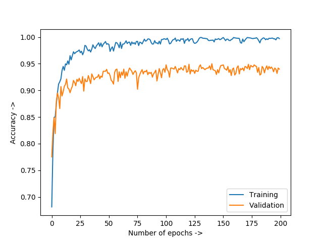
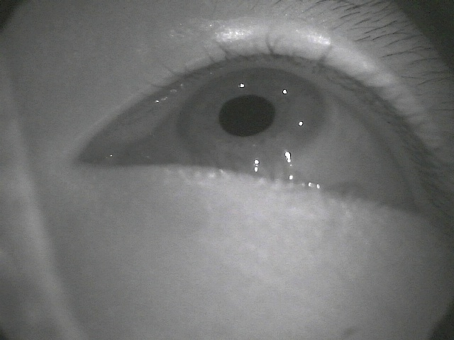
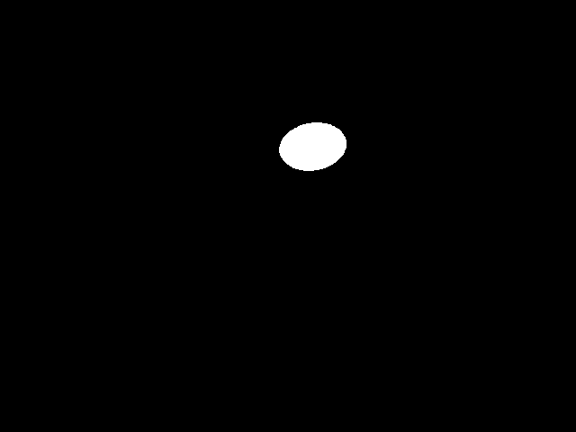
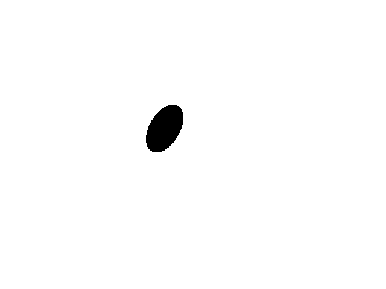
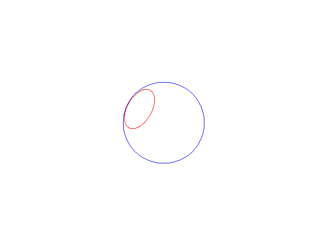

This is a repo created for the first assignment. 

## *** WORKING of CNN Code ***
1.The train.py code has the model as instructed with 3 convolution layers and 2 fully connected layers.

2.predict.py takes image all the images from the directory as input and gives binary output for all of them.

3.plot.py shows the accuracy of the model with number of epochs.

### PLOT OF ACCURACY vs NUMBER OF EPOCHS

## Programming Pupil Detection

### Pupil_detection

This code takes image of an eye as input and gives the detected contour of pupil as output.

To compile the code use the command:- 

g++ pupil_detection.cpp `pkg-config --cflags --libs opencv` -o pupil_detection

To run the file, use the command:-

./pupil_detection

#### Input and output images
 

### Pupil_pose_estimation

This code takes synthetic image of pupil as an input and gives out the projection of sphere and 3-D circle on a new image and also the center, radius and normal of the 3-D circle(on the terminal).

To run the code use the command:- 

g++ pupil_pose_estimation.cpp `pkg-config --cflags --libs opencv` -o pupil_pose_estimation

To run the file, use the command:-

./pupil_pose_extimation

#### Input and output images
 
